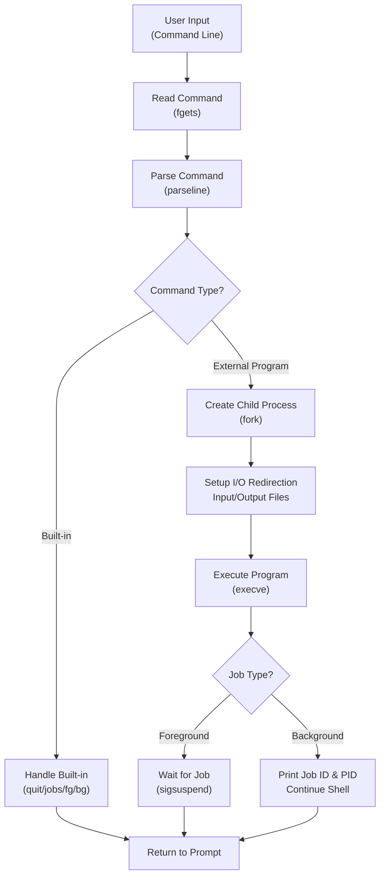
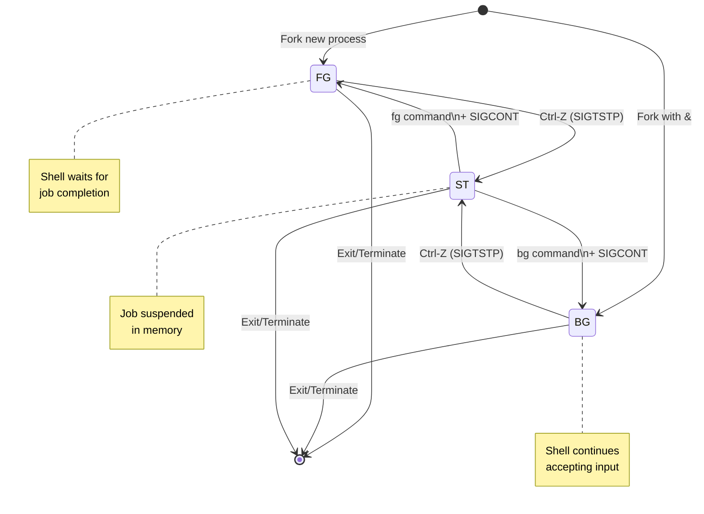
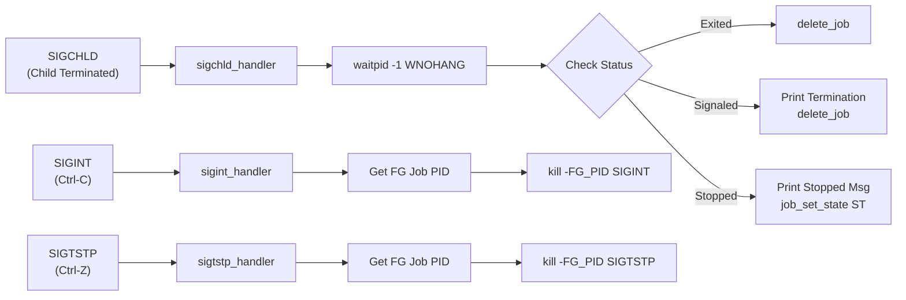
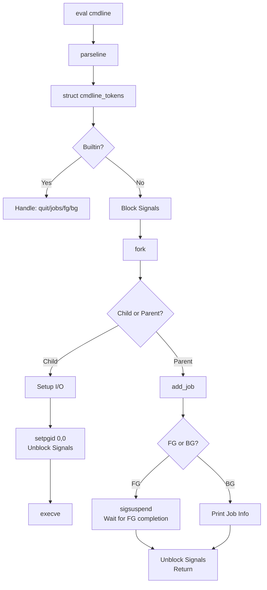
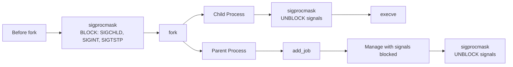
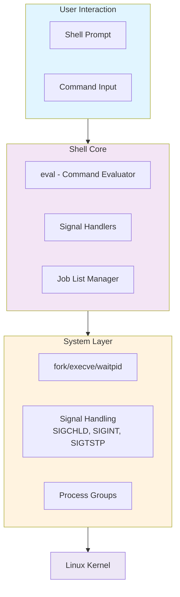

# Unix Shell

## 📋 Brief Description

**tsh** is a lightweight Unix shell implementation that provides essential job control and command execution capabilities. It allows users to execute programs in the foreground or background, manage running processes, and handle signals for job control.

### Key Features
- **Foreground/Background Execution**: Run jobs in foreground (interactive) or background (non-interactive) modes
- **Job Management**: Track and manage multiple concurrent jobs with unique job IDs
- **Signal Handling**: Handle SIGINT (Ctrl-C), SIGTSTP (Ctrl-Z), and SIGCHLD signals
- **Built-in Commands**: `quit`, `jobs`, `fg` (foreground), and `bg` (background)
- **I/O Redirection**: Support input (`<`) and output (`>`) redirection
- **Process Control**: Stop, resume, and terminate jobs

---

## 🔄 Shell Execution Flow



---

## 🎛️ Job States & Transitions



---

## 🔐 Signal Handling Architecture



---

## 📊 Built-in Commands Summary

| Command | Purpose | Behavior |
|---------|---------|----------|
| `quit` | Exit shell | Terminates the shell process |
| `jobs [> outfile]` | List jobs | Shows all active jobs with ID, PID, and state |
| `fg <jid\|pid>` | Run in foreground | Move stopped job to foreground, resume with SIGCONT |
| `bg <jid\|pid>` | Run in background | Move stopped job to background, resume with SIGCONT |

---

## ⚙️ Core Components

### 1. **Command Parser** (`parseline`)
- Parses command line into tokens
- Detects foreground/background execution (`&` suffix)
- Handles I/O redirection (`<`, `>`)
- Supports quoted arguments

### 2. **Job List Manager** (`tsh_helper.c`)
- Maintains list of up to 64 concurrent jobs
- Tracks Job ID (JID), PID, state, and command line
- Provides async-signal-safe operations

### 3. **Signal Handlers**
- **SIGCHLD**: Reaps terminated child processes
- **SIGINT**: Forwards Ctrl-C to foreground job
- **SIGTSTP**: Forwards Ctrl-Z to foreground job
- **SIGQUIT**: Emergency cleanup on quit signal

### 4. **Process Management**
- Uses `fork()` to create child processes
- Uses `execve()` to execute external programs
- Uses `waitpid()` with `WNOHANG | WUNTRACED` for non-blocking reaping
- Manages process groups for signal delivery

---

## 🔗 Data Flow: Command Execution



---

## 🛡️ Signal Masking Strategy

The shell uses signal masking to prevent race conditions:



---

## 📝 Job Control Example

```
tsh> ./program &           ← Background execution
[1] (12345) ./program      ← Job ID [1], PID 12345
tsh> ./another             ← Foreground execution
^Z                         ← User presses Ctrl-Z
Job [2] (12346) stopped by signal 20
tsh> jobs                  ← List active jobs
[1] (12345) Running     ./program
[2] (12346) Stopped     ./another
tsh> fg %2                 ← Resume job 2 in foreground
tsh> bg %2                 ← Resume job 2 in background
[2] (12346) ./another
```

---

## 🏗️ Architecture Layers



---

## 🔧 Implementation Language

- **Primary**: C (CSC 15-213 Shell Lab)
- **Helper Libraries**: CSAPP (Computer Systems: A Programmer's Perspective)
- **Compilation**: GCC with strict error checking
- **Dependencies**: POSIX-compliant system calls

---

## 📌 Key Design Principles

1. **Async-Signal Safety**: All signal handlers use only async-signal-safe functions
2. **Race Condition Prevention**: Strategic signal blocking around critical sections
3. **Resource Management**: Proper cleanup of job list and file descriptors
4. **Error Handling**: Graceful error messages for permission denied and missing files
5. **Job ID Recycling**: Efficient reuse of job IDs (1-64)

---

## Notes
Upon request, code can shown for professional purposes.
